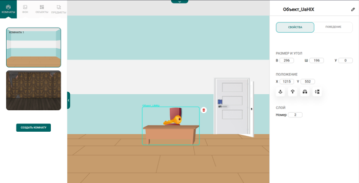
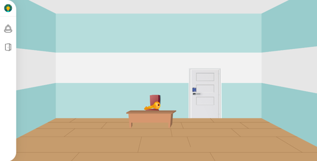
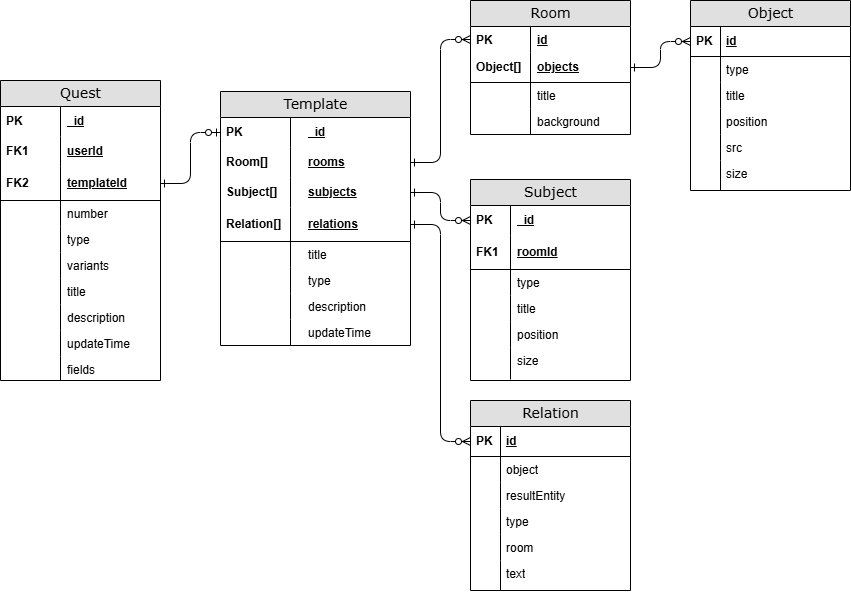

# Quest Builder — Конструктор интерактивных квестов

## О проекте

**Quest Builder** — веб-приложение для создания интерактивных квестов с нуля. Проект разработан как дипломная работа в команде с дизайнером.

---

## Цель проекта

Разработать полнофункциональный конструктор квестов, который позволяет пользователям самостоятельно создавать интерактивные квесты без ограничений предустановленных шаблонов.

---

## Контекст

Пользователи платформы **joyteka.com** сталкивались с ограничением: они могли использовать только предустановленные шаблоны тестов и не имели возможности создавать собственные квесты с нуля. Это ограничивало их творческий потенциал и не позволяло реализовывать уникальные образовательные сценарии.

---

## Задача

Создать веб-приложение, которое позволит пользователям:
- Создавать квесты с нуля с помощью визуального редактора
- Проектировать интерактивные сценарии с комнатами, объектами и предметами
- Настраивать логику взаимодействия между элементами квеста
- Использовать созданные квесты для обучения и развлечения

---

## Технологический стек

### Frontend
- **Next.js 14.2.15** — React-фреймворк для SSR и роутинга
- **TypeScript** — типизация кода
- **React 18** — UI библиотека
- **Pixi.js 7.4.2** — игровой движок для визуального редактора
- **SCSS/SASS** — стилизация
- **Tailwind CSS** — utility-first CSS фреймворк

### Backend
- **Next.js API Routes** — серверная логика
- **MongoDB 6.9.0** — база данных
- **AWS S3** — хранение файлов и изображений

### Инструменты разработки
- **Docker & Docker Compose** — контейнеризация
- **ESLint** — линтинг кода
- **PostCSS** — обработка CSS

### Дополнительные библиотеки
- `react-draggable` — перетаскивание элементов
- `react-resizable` — изменение размеров элементов
- `qrcode` — генерация QR-кодов
- `react-toastify` — уведомления
- `formidable` — обработка загрузки файлов

---

## Роль в проекте

**Full-stack разработчик**

- Проектирование и разработка архитектуры приложения
- Проектирование схемы базы данных MongoDB
- Разработка визуального редактора квестов на Pixi.js
- Реализация API для работы с квестами и шаблонами
- Интеграция с AWS S3 для хранения файлов
- Настройка Docker-окружения для деплоя
- Разработка UI/UX компонентов (в сотрудничестве с дизайнером)

---

## Дизайн

Дизайн проекта разработан в Figma:
[Ссылка на макет](https://www.figma.com/design/0PcLwiL8WN70FkhRDntba3/Untitled?node-id=0-1&p=f&t=iKzbUVEBQ7yIjoS6-0)

---

## Действия (Реализованный функционал)

### 1. Визуальный редактор квестов
- Создание и редактирование комнат с настраиваемыми фонами
- Добавление объектов и предметов на игровую доску
- Настройка позиций и размеров элементов через drag & drop
- Установка связей между объектами (relations)
- Настройка поведения объектов и предметов

### 2. Система шаблонов
- Создание шаблонов для быстрого старта
- Редактирование существующих шаблонов
- Использование шаблонов при создании новых квестов

### 3. Управление квестами
- Создание новых квестов
- Редактирование существующих квестов
- Удаление квестов
- Просмотр списка всех квестов

### 4. Игровой режим
- Прохождение созданных квестов
- Интерактивное взаимодействие с объектами
- Система вопросов и ответов
- Проверка правильности ответов

### 5. Загрузка и хранение файлов
- Загрузка пользовательских изображений
- Интеграция с AWS S3
- Управление медиа-файлами

### 6. База данных
- Проектирование схемы для квестов, шаблонов, комнат, объектов и предметов
- Оптимизация запросов к MongoDB
- Реализация CRUD операций

---

## Скриншоты

<!-- Здесь будут размещены скриншоты приложения -->


### Визуальный редактор



### Игровой режим


---

## 🗄 Схема базы данных



---

## Результаты

### Функциональные результаты
- Полнофункциональный конструктор квестов с визуальным редактором
- Система шаблонов для ускорения создания квестов
- Интерактивный игровой режим для прохождения квестов
- Интеграция с облачным хранилищем для медиа-файлов
- Масштабируемая архитектура с использованием Docker

### Технические результаты
- Проектирование и реализация схемы БД с оптимизацией запросов
- Разработка сложного UI с использованием Pixi.js для игрового движка
- Реализация drag & drop функциональности для интуитивного редактирования
- Настройка CI/CD через Docker Compose

### Пользовательские результаты
- Пользователи могут создавать уникальные квесты без ограничений шаблонов
- Интуитивный интерфейс для быстрого освоения инструмента
- Гибкая система настройки логики квестов

---

---

## Запуск проекта

### Требования
- Node.js 18+
- Docker и Docker Compose (для деплоя)
- MongoDB (или использование Docker-контейнера)
- AWS S3 аккаунт (для хранения файлов)

### Установка зависимостей
```bash
npm install
```

### Настройка окружения
Скопируйте содержимое файла `.env.example` в файл `.env` и заполните все поля:
- MongoDB connection string
- AWS S3 credentials
- Другие необходимые переменные окружения

### Запуск в режиме разработки
```bash
npm run dev
```

Приложение будет доступно по адресу [http://localhost:8080](http://localhost:8080)

### Запуск через Docker
```bash
docker compose up -d --build
```

Приложение будет доступно по адресу [http://localhost:3000](http://localhost:3000)

---

## Структура проекта

```
quest_builder/
├── components/          # React компоненты
│   ├── questBuilder/   # Компоненты редактора квестов
│   ├── button/         # UI компоненты
│   └── ...
├── pages/              # Next.js страницы и API routes
│   ├── api/            # API endpoints
│   ├── create.tsx      # Создание квеста
│   ├── edit/           # Редактирование квестов
│   └── ...
├── types/              # TypeScript типы
├── utils/              # Утилиты
├── public/             # Статические файлы
└── ...
```

---

## Выводы

### Что было достигнуто
1. **Решена бизнес-задача**: Пользователи получили возможность создавать квесты с нуля, что расширило функциональность платформы
2. **Технический опыт**: Освоена работа с игровым движком Pixi.js, проектирование сложных схем БД, интеграция с облачными сервисами
3. **Архитектурные решения**: Реализована масштабируемая архитектура с разделением на компоненты и модули

### Технические вызовы
- Интеграция Pixi.js с React для создания интерактивного редактора
- Оптимизация работы с большим количеством объектов на игровой доске
- Проектирование гибкой схемы БД для хранения сложной структуры квестов

### Уроки и улучшения
- Важность тщательного проектирования схемы БД на ранних этапах
- Необходимость оптимизации рендеринга при работе с большим количеством элементов
- Преимущества использования TypeScript для поддержания типизации в сложных проектах

---

## Лицензия

Проект разработан в рамках дипломной работы.

---

## Команда

- **Разработчик**: Мелехин Артём Владимирович
- **Дизайнер**: Дедюхина Юлия Сергеевна

---

